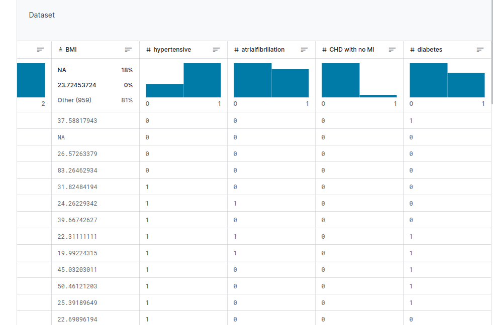

# mortaility-prediction-model

The prediction of in-hospital mortality for intensive care units (ICU) admitted HF patients remains poorly characterized. I aimed to develop a solutions using a predictive model for mortality prediction, considering in-hospital mortality in intensive care unit patients with heart failures. 

# Model Training 


MIMIC III is a large, freely available database comprising  de identified health-related data associated with over forty thousand patients who stayed in critical care units of the Beth Israel Deaconess medical center between 2001 and 2012. 

Different machine learning model was trained, evaluated and deployed on  Streamlit web application framework for mortality prediction

# To run

``` 
pip install -r requirements.txt
```
then run 

```
streamlit run app.py
```


